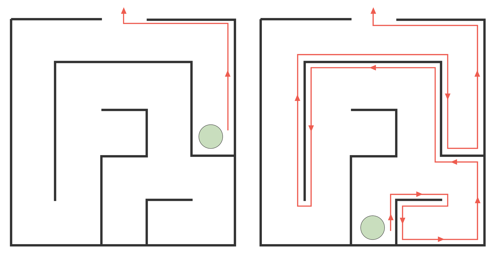
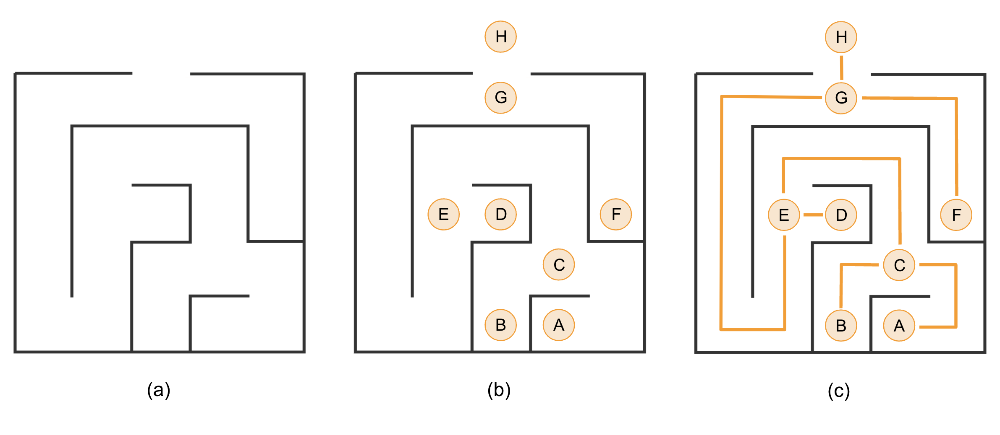
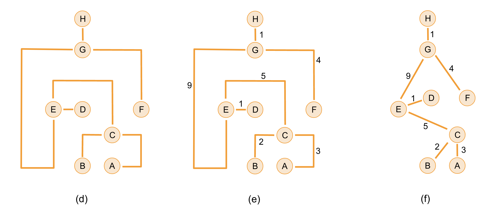

You wake up from a crazy evening at a Data Science conference in the middle of a cornfield maze. You look to your left, and see corn. To your right, corn. You have no idea how you got here, nor how to get back to civilisation in time for the rest of the conference!

<!--more-->

Fortunately, you are good at thinking on your feet. 

> Are you being chased by a minotaur and need a way out quick? Jump straight to the [path-finding section](#shortest-path-finding), or the [Dijkstra's algorithm walkthrough](#dijkstras-algorithm).

--------

### Escaping a maze

Your mind still clouded from yesterday's networking reception, you rack your brain for escape strategies. You can see rain clouds on the horizon, and would really like to get back to your hotel room...

As with most things, a simple but effective strategy is randomness. Flipping a coin at each intersection will get you out eventually, but chances are it will take ages and the conference will be over by then.  

### The right-hand approach

You suddenly remember a trick a mysterious old man at the conference told you about. You can't remember how the conversation started, or why a mysterious old man would be walking around a Data Science conference, but the trick went something like this:

> To escape a maze, put your right hand against the wall. Start walking, always keeping your hand on the wall. Follow the wall along turns at intersections and U-turns at dead ends. Eventually, you will reach the exit.

The images below demonstrates the strategy. We start from the green dot, put our right hand on the wall, never let go, and follow it all the way to the exit. Depending on where we start in the maze, this can take us on quite a winding path, even in a simple maze. 

Maybe, in the absence of better ideas, you should just go for it and start walking? You head off, but after a few minutes, your surroundings start to feel rather familiar, and after a few more minutes, you're pretty confident you're walking in circles. 

Does this strategy actually work all the time? You pull out a piece of paper, start drawing, and quickly come up with a problematic scenario: 



Because of the circular design, you risk getting caught in a loop, forever walking circles around the same block!

Looks like mysterious old men at conferences aren't the solution to everything...

---------

### Hansel and Gretel

What next then? If you happen to be carrying around a big bag of breadcrumbs (or a bucket of paint, or a piece of chalk), you can take the Hansel and Gretel approach, formalised in Maths as [**Tremaux's Algorithm**](https://en.wikipedia.org/wiki/Maze-solving_algorithm#Tr%C3%A9maux's_algorithm), a depth-first search. 

> In short, leave a trail of breadcrumbs. If you need to turn back, leave a second trail on your way out. Then, at intersections, never pick a path that already has two trails of crumbs, because that means you've been in, and came back out without luck. 

This method ensures that you will make your way out (assuming birds don't eat your breadcrumbs), but it doesn't guarantee *the shortest path*, and you do so love an optimal solution...

--------

### Shortest-path finding

Shortest-path finding is a much-beloved topic in Maths and Computer Science. Beyond its life-saving applications in escaping mazes, path-finding algorithms are extremely useful when it comes to routing internet traffic, managing a public transport network, or exploring connections in a social network. 

Path-finding lives within the realm of **Graph Theory**, where we seek to express a situation as a group of connected *nodes* (or *vertex/vertices*). These nodes could be people connected by friendships, cities connected by roads, computers connected by network cables or WiFi, intersections in a maze connected by paths, ...

How do you turn a maze into a graph? Have a look below:

> - We start off with our simple maze from before. Our first step is to label all the intersections, dead ends, and the exit, as shown in (b). 
> - We then draw all the paths between them (c). 
> - Now that we have our *nodes* and connections (called *edges*), we can get rid of the maze itself (d). 
> - We then need to record the distance (in steps, metres, bananas, ...) of each edge (e). 
> - Lastly, we simplify our edges by representing them as straight lines, keeping the distance label for each. We call this the *cost* of traveling along that path (f). Sometimes, the graph gets simplified even further by lining everything up with right angles. 

Note, at this point, we no longer have any concept of the actual shape of the maze, only the intersections we can travel through, and the distances between them. 

A less abstract way to represent a maze as a graph is to simply label every point (say every square metre) as a node, all with distance 1 between them, rather than focusing on the intersections. This will be the representation we use when describing our path-finding algorithm. 

------

Now that we're in a Graph Theory mindset, it's time to get to work. 

All that walking in circles has cleared your brain fog a bit, and you remember that you're carrying a bag with you.

You open your backpack and check what you have to work with. You find your laptop, and (conveniently) a drone with a camera. That looks promising! You spin up the drone, send it flying, and a few minutes later, you have an aerial photo of the maze on your laptop. It is much bigger than imagined! if you have to try and find your way through it by luck or breadcrumbs, you'd be here forever. 

Some quick Googling brings you to Dijkstra's algorithm...

### Dijkstra's Algorithm

Dijkstra's algorithm is a well-known path-finding technique which works great for situations where we have a single source or start point (such as a person lost in a maze), and going from node to node always costs some positive value. Distances are always positive, so in terms of navigating a maze or transport network, that's all good for us! Let's approach this in three levels of detail:

>**Detail level 1:**
>
> The algorithm starts at the source (us), and radiates out from there, giving every node (every square in our maze) a *'distance from start'* value. If later on, it finds a shorter way to a square, it overwrites the distance value, so that it always records the *shortest distance* to a square. 

To demonstrate Dijkstra's algorithm, let's use a slightly altered version of the square maze from before, where the right-hand technique kept us walking in circles:



We start at the green dot, and need to find the shortest path to the exit at the top of the maze. We have multiple ways of getting there, but only one of them will be the fastest. 

-------

In the case of our maze, we can expand on the details a bit like this:
> **Detail level 2:**
>
 > Put all the accessible squares of the maze on a to-do list.
 >
 > We give our starting point a distance `0`. We make this our 'current' square.
 >
 > We check where we can go from here (left, right, up or down, unless there's a wall), and we give neighbours we can reach a distance `1` (i.e. the 'current' distance, plus the cost of one step).  
 >
 > Once we have checked all our neighbours, we tick the current square off our to-do list.
 >
 > We pick our next 'current' square, picking the one from the to-do list with the lowest distance. 
 >
 > Repeat until we have processed the exit. 

The gif below illustrates the algorithm at work. 



What's important to note is that there is a **'no backtracking'** rule. Once a node is processed and ticked off the to-do list, we don't come back to it, and it is no longer considered a valid neighbour. This stops the algorithm from going around in circles when assigning distances. 

**Let's dig a bit more into what is happening.** Zooming in on just the centre of the maze:

- We mark the start point as distance 0. (a)
- We highlight it in yellow to indicate it is the 'current' node, and find all valid neighbours. In this case, there are three walls surrounding the tile, and we can only move down (b).
- We calculate the distance of the bottom neighbour as our current distance (0), plus 1. (c) This score is lower than what was recorded there previously: as we hadn't considered the tile yet, the score was set to infinity. 
- Once all neighbours are dealt with, we switch the current tile to green to indicate it's been processed, and we scratch it off our to-do list. (d)
- Next, we pick the not-yet-green tile with the lowest score as our next tile. (e) Note that although the tile has two possible neighbours, we can no longer go up as that tile is already processed (green). We only have left as a valid neighbour. (f)



Because we always pick the next current node as an unseen node with the lowest distance, we guarantee we never need to come back to processed nodes. Any path we could create that way would be longer than what was previously calculated. 

Before we formalise the algorithm, let's look below at how the algorithm handles a few specific situations:

- **Splits**: If we are considering a tile with multiple valid neighbours, it doesn't matter in which order we process them, but we don't mark the current tile as complete until we have calculated a distance for all its neighbours. (a)
- **Dead ends**: We don't back-track onto green tiles. In (b), the yellow tile has no valid neighbours because the bottom has already been processed. We simply tick off the tile without doing anything. 
- **Worse paths**: In (c), the 9 above our yellow tile had previously already received a distance score from its left neighbour. The distance that we are now calculating for it is not any shorter than what is already recorded (it's the same), so we do not overwrite its distance score. 



-------

For our final level of detail, let's take an almost pseudo-code approach, introducing ideas such as creating a list and a dictionary to keep track of our not_visited nodes and the distances. 

> **Detail level 3:**
>
> 1. Create a `not_visited` list of all accessible nodes.
> 2. Create a dictionary or table for distance values, starting all nodes except the start point at `infinite` distance. 
> 3. Set the distance entry for the start point to `0`.
> 4. Mark the start point as the `current` node.
> 5. For each (accessible) neighbour of the current node: 
>    - check if it has already been visited (i.e. if it's been removed from not_visited). If so, skip it.
>    - If the neighbour is still in `not_visited`, calculate its distance as the distance value of the current node, plus the cost of traveling between them.  
>    - If that calculated distance is less than what's currently recorded, overwrite the recorded value.  
> 6. When all neighbours are processed, remove the current node from not_visited.
> 7. Pick the node from not_visited with the lowest distance value as the next current node. 
> 8. Repeat steps 3-7 until the target node has been processed. 

To explore the code implementation in a bit more detail, I have taken an example from one of my favourite coding challenges, Advent of Code. You can read about it in [Climbing Mountains]()

### A note on Time Complexity

A question we should ask ourselves if we plan to roll out any solution at scale, is how long it takes to run, and how much slower it gets on bigger datasets (mazes). In this simple implementation of the algorithm, we need to process every node once, and for each node, we need to consider all its neighbours. For our maze, that means we need to do up to $4* nodes$ checks.

Generally, when calculating time complexities, we consider the worst case scenario. In the general version of Dijkstra's algorithm, the worst case scenario is when every node is connected to every other node. That way, for $V$ nodes (v for vertex), we need to check $V-1$ neighbours. So, as the nr of nodes goes up, our processing time goes up by $V*(V-1)$ which we approximate as $(V^2)$. As we double the nr of nodes, processing time goes up x4.

More recent versions of Dijkstra's implementation, making use of binary tree structures, scale better on large networks.

--------

Got questions? Spotted any issues in the code? Or do you want to share your own examples of implementations? Drop me a message on [LinkedIn](https://www.linkedin.com/in/mark-wentink-793217116/)